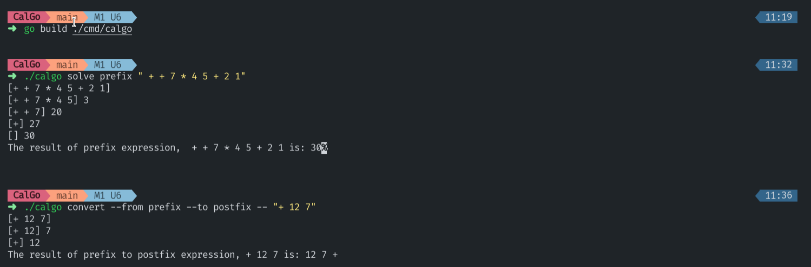

# CalGo

It is a command line tool that solves the prefix and postfix expression, it also converts the expression into desired form.

## Prerequisite

Please [install and set-up Golang](https://go.dev/doc/install) on your system in advance.

## How to run this project?

1. Clone this Project and Navigate to the folder.

```bash
https://github.com/k-avy/CalGo.git
cd CalGo
```

2. Build the project using following command.

```bash
go build ./cmd/calgo
```

3. Run the executable in your vscode terminal.

```bash
./calgo
```

4. You can directly run it by the following command.

```bash 
go run ./cmd/calgo
```


## Features

1. You can solve Prefix and Postfix of an expression using the following command.

```bash 
# for prefix expression
./calgo solve prefix <expression here as string>

# for postfix expression
./calgo solve postfix -- <expression here as string>
```

2. You can convert from (prefix or postfix) to (prefix,postfix or infix) using the command.

```bash
./calgo convert --from <type> --to <type> -- <expression here as string>
```

3. To get help you can run this command.

```bash
./calgo --help
```

4. Screenshot of the command line.


